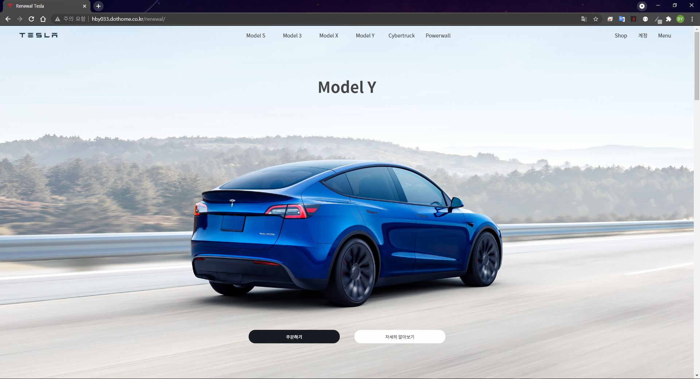

# Renewal-Tesla



## Overview 😎


리뉴얼 프로젝트의 일환으로 Tasla 웹사이트를 리뉴얼 제작해 보았습니다.  전체 page 중 index.html 과 modelS.html 페이지를 제작하였으며 scroll Event와 slide, wow plugin를 활용하여 만들었습니다. index.html의 경우 scroll Event에서 아직 해결되지 않은 [Issue](##Issue)가 있으니 아래 항목을 참조해주시면 감사하겠습니다.

호스팅 링크 : [http://hby033.dothome.co.kr/renewal/index.html](http://hby033.dothome.co.kr/renewal/index.html)

## Requirement

- HTML
- CSS
- Javascript
- [Jquery 3.6.0](https://code.jquery.com/)

## Plugin

wow plugin의 Free 버전을 활용하여 제작하였습니다.

mouse wheel plugin의 경우 아래 링크를 참조해 주세요.

- [wow plugin](https://wowjs.uk/)
- [jQuery mouse Wheel Plugin](https://github.com/jquery/jquery-mousewheel)

## Function

1. Navigation
    - modal menu
2. index page
    - mouse wheel plugin
    - When you control mousewheel, page auto move
3. modelS page
    - wow plugin
    - slide function

## Issue


현재 마우스 스크롤시 index page 내에서 auto move을 실행시키는 기능과 현재 page에 맞는 이미지를 출력하는 기능과의 충돌이 있어 정상적인 scroll event가 실행되지 않고 있습니다. 추후 update를 통해 문제를 해결할 수 있도록 노력해보겠습니다. 문제 해결을 위한 좋은 의견이 있으시다면 남겨주시면 감사하겠습니다.

```jsx
// When you control mousewheel, page auto move
  $(window).scroll(function () {
    var scroll = $(window).scrollTop();
    let secTop_list= new Array();
    let secBtm_list = new Array();
    let mainCon = document.querySelectorAll('nav');
   
    const bg = $('.bg');

    const resetCss = ()=> {$('nav').children().addClass('fadeOut')};
    const rseCss = ()=> {$('nav').children().removeClass('fadeIn')};
    
    for (var i = 0; i < $(".bg").length; i++) {
      var secTop = $(".bg").eq(i).offset().top;
      secTop_list[i] = secTop;
      var secBtm = secTop + $(".bg").eq(i).innerHeight();
      secBtm_list[i] = secBtm;
    };
    
    console.log(secTop_list[i-1]);

    var moveMouseWheel = function () {
      $(this).mousewheel(function (event, delta) {
        for (var i = 0; i < $(".bg").length; i++) {
          if(delta > 0){
            if(scroll > secTop_list[i] && scroll < secBtm_list[i] - 1){
              $("html,body").stop().animate({"scrollTop":secTop_list[i]}, 1500);
              resetCss();
              rseCss();
              $('nav').eq(i).children().addClass('fadeIn');
            };

          } else if(delta < 0){
            if(scroll > secTop_list[i] && scroll < secBtm_list[i] - 1){

              $("html,body").stop().animate({"scrollTop":secTop_list[i+1]}, 1500);
              resetCss();
              rseCss();
              $('nav').eq(i+1).children().addClass('fadeIn');
            }
          };
        };
      });
    };
    moveMouseWheel();

    //현재 스크롤 위치에 맞는 이미지 출력
    const scrollImg = () => {
      for (var i = 0; i < $(".bg").length; i++) {
        if(scroll >= secTop_list[i]){
          resetCss();
          rseCss();
          $('nav').eq(i).children().addClass('fadeIn');
        } 
      };
    }
    scrollImg();
  });
```
